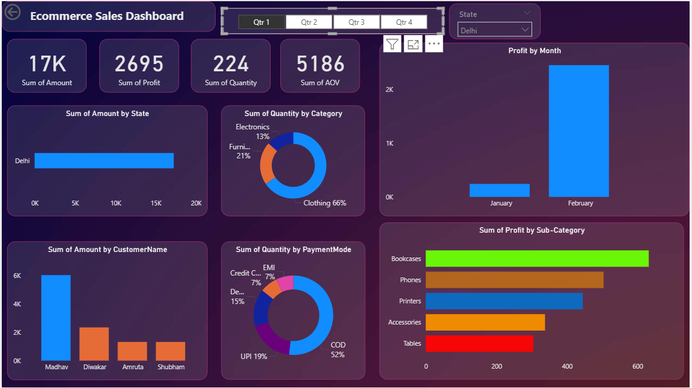

# 📊 Ecommerce Sales Dashboard  

An interactive **Power BI Dashboard** analyzing Ecommerce sales, profit, customers, and payment behavior.  
This project is designed to help businesses make data-driven decisions by providing clear insights into performance.  

---

## 📌 About the Project  
The **Ecommerce Sales Dashboard** provides a complete view of business performance through:  
- Sales KPIs (Revenue, Profit, Quantity, AOV)  
- Customer behavior analysis  
- Product category & sub-category trends  
- Payment mode distribution  
- State-wise and monthly analysis  

The goal is to track performance, find growth opportunities, and support better decision-making.  

---

## 🛠 Tools & Technologies Used  
- **Power BI** → Dashboard creation & data visualization  
- **Excel (CSV/XLSX)** → Data cleaning & preparation  
- **GitHub** → Project hosting & version control  

---

## 📂 Dataset Information  

This project uses **two datasets**:  

1. **Orders Dataset**  
   - Order ID  
   - Order Date  
   - Ship Date  
   - Customer Name  
   - Segment  
   - State  
   - Region  
   - Category  

2. **Details Dataset**  
   - Order ID  
   - Product Name  
   - Sales  
   - Quantity  
   - Discount  
   - Profit  
   - Payment Mode  

---

## ✨ Features of the Dashboard  
✔ **KPI Cards** → Sales, Profit, Quantity, AOV  
✔ **Filters** → Quarterly & State-wise filters  
✔ **Customer Analysis** → Top customers by sales  
✔ **Product Insights** → Category & Sub-category performance  
✔ **Payment Analysis** → COD, UPI, Credit Card, Debit Card, EMI  
✔ **Time Analysis** → Monthly profit trend  

---

## 🖼 Dashboard Screenshot  

  

---

## 📊 Key Insights  
- Clothing contributed **66% of the total sales quantity**  
- **Cash on Delivery (COD)** was the most used payment mode (**52%**)  
- **Bookcases** generated the highest profit among sub-categories  
- **Madhav** emerged as the top customer by sales amount  
- **February** recorded the highest profit compared to January  

---

## ⚡ How to Run the Project  

1. Clone the repository  
   ```bash
   git clone https://github.com/NikitaCKyatanavar/Ecommerce-Sales-Dashboard.git
